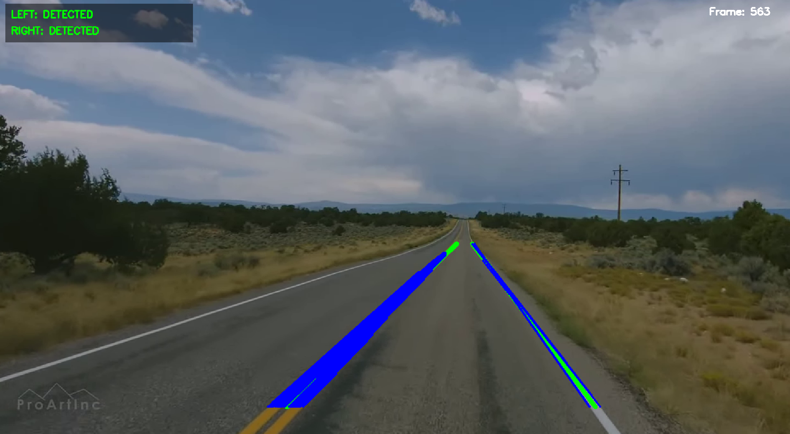

# Lane Tracking System

Real-time lane detection in video using C++ and OpenCV. Detects both white and yellow lane markings using color masking, Canny edge detection, and Hough Line Transform.



## Quick Start

```bash
# Build and run
./build_and_run.sh data/input.webm

# Or manually
mkdir build && cd build
cmake .. && make
./lane_tracking_kalman --video=../data/input.webm --output=../results/output.avi
```

## Requirements

- CMake (>= 3.10)
- C++14 compiler
- OpenCV (>= 4.x)

**Arch Linux**: `sudo pacman -S opencv cmake`

## Usage

```bash
# Webcam
./lane_tracking_kalman

# Video file
./lane_tracking_kalman --video=path/to/video.mp4

# Save output
./lane_tracking_kalman --video=input.mp4 --output=results/output.avi

# Specific camera
./lane_tracking_kalman --camera=1
```

## Controls

| Key | Action |
|-----|--------|
| `ESC` / `q` | Quit |
| `SPACE` | Pause/Resume |
| `r` | Toggle ROI visualization |
| `X button` | Close window |

## Features

- ✓ White and yellow lane detection (HLS color space)
- ✓ Canny edge detection + Hough Line Transform
- ✓ ROI-based filtering
- ✓ Real-time video processing
- ✓ Resizable window
- ✓ Video output support

## Output

- **Green lines**: Averaged detected lanes
- **Blue lines**: Individual detected segments
- **Status overlay**: Detection confidence
- **Frame counter**: Processing progress

## Project Structure

```
lane-tracking-kalman/
├── src/                    # Source files
├── include/                # Headers
├── data/                   # Input videos
├── results/                # Output videos
└── build/                  # Build directory
```

## Roadmap

- [x] Basic lane detection
- [x] White and yellow lane support
- [x] Line classification and averaging
- [ ] Kalman filter for temporal smoothing
- [ ] Polynomial lane models
- [ ] Multi-lane detection

## License

Educational and research purposes.
